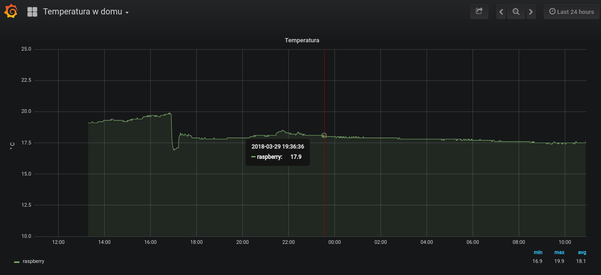

I always wanted to play a bit with Raspberry Pi outside of work. My father was constantly complaining about me not making fire in the morning (but rather in the afternoon) and the temperature in the house being too low to his taste. So I created this small project to constantly monitor the interior temperature with Raspberry and DS18B20 sensor.

This project has 3 parts:
* Node.js script running on Raspberry, which checks current temperature and sends it to the server
* MySQL database, which is collecting incoming sensor data and storing it
* Grafana and a custom dashboard to visualize the data

